RPG ツクール MV - 謎解きマップシステムプラグイン
====================

マップ上のキャラクター移動やイベントシステムを拡張し、立体的な謎解きの幅を広げるための様々な機能を追加します。

※元ネタは [黄金の太陽シリーズ](https://ja.wikipedia.org/wiki/%E9%BB%84%E9%87%91%E3%81%AE%E5%A4%AA%E9%99%BD) の謎解きシステムです。

English document in process: [English page](README.en_US.md)

[Gallery ページ](docs/Gallery.md) でサンプルの画面を見ることができます。

**ダウンロード**

| Version | File |
|---------|------|
| v0.5.0  | [:arrow_down: LN_AdvancedMapPuzzleSystem.js](https://raw.githubusercontent.com/lriki/LN_AdvancedMapPuzzleSystem/master/js/plugins/LN_AdvancedMapPuzzleSystem.js) |


----------

**サンプルプロジェクトについて**

RPG ツクール MV で新規プロジェクトを作成し、[:arrow_down: こちら](https://github.com/lriki/LN_AdvancedMapPuzzleSystem/archive/master.zip) からダウンロードしたすべてのファイルを上書きしてください。

**開発状況について**

このプラグインは以前に @lriki がRPGツクールXP用に開発したプラグインのリメイクです。
そちらで実装されていた全ての機能の達成を以って、バージョン 1.0.0 とする予定です。

また [JavaScriptでの実装](https://github.com/lriki/RPGMakerMV/tree/master/LN_AdvancedMapPuzzleSystem) を TypeScript に移行中です。

未実装の機能は  でマークされています。

プラグインを変更する場合は [開発ガイド](docs/Development.md) を参照してください。

**不具合情報について**

既知の問題や修正済みの問題については次のリンク先をご確認ください。

- [不具合情報](https://github.com/lriki/LN_AdvancedMapPuzzleSystem/issues)


目次
----------

<!-- TOC orderedList:true -->

1. [前提条件・注意事項](#前提条件・注意事項)
    1. [プラグイン全般](#プラグイン全般)
    2. [画像素材について](#画像素材について)
2. [プラグインの用語](#プラグインの用語)
    1. [ホールタイル](#ホールタイル)
    2. [エッジタイル](#エッジタイル)
    3. [マップオブジェクト](#マップオブジェクト)
    4. [ガイドライン](#ガイドライン)
    5. [マップスキル](#マップスキル)
3. [キャラクター移動の拡張](#キャラクター移動の拡張)
    1. [1マス分のホールタイルのジャンプ](#1マス分のホールタイルのジャンプ)
    2. [1マス分のエッジタイル間のジャンプ](#1マス分のエッジタイル間のジャンプ)
4. [マップオブジェクト](#マップオブジェクト-1)
    1. [マップオブジェクトの作り方](#マップオブジェクトの作り方)
5. [マップオブジェクト - 箱](#マップオブジェクト---箱)
    1. [パラメータ](#パラメータ)
    2. [箱オブジェクトに歩行で乗る](#箱オブジェクトに歩行で乗る)
    3. [箱オブジェクトにジャンプで乗る](#箱オブジェクトにジャンプで乗る)
    4. [特定のイベント実行による箱オブジェクトからの降下](#特定のイベント実行による箱オブジェクトからの降下)
    5. [箱オブジェクトを押して移動する](#箱オブジェクトを押して移動する)
    6. [箱オブジェクトの落下](#箱オブジェクトの落下)
    7. [箱オブジェクトの積み重ね](#箱オブジェクトの積み重ね)
    8. [箱オブジェクト落下時のイベント起動](#箱オブジェクト落下時のイベント起動)
    9. [プレイヤーの乗降によるイベントの起動](#プレイヤーの乗降によるイベントの起動)
    10. [マップオブジェクトの位置の永続化](#マップオブジェクトの位置の永続化)
6. [マップオブジェクト - スイッチ](#マップオブジェクト---スイッチ)
    1. [パラメータ](#パラメータ-1)
    2. [キャラクターの乗降によるイベントの起動](#キャラクターの乗降によるイベントの起動)
7. [マップオブジェクト - 丸太](#マップオブジェクト---丸太)
    1. [パラメータ](#パラメータ-2)
    2. [丸太タイプマップオブジェクトの移動](#丸太タイプマップオブジェクトの移動)
    3. [溝への落下](#溝への落下)
    4. [上に乗れる丸太](#上に乗れる丸太)
8. [マップオブジェクト - 滑り台](#マップオブジェクト---滑り台)
    1. [パラメータ](#パラメータ-3)
9. [マップオブジェクト - ホール](#マップオブジェクト---ホール)
10. [マップスキル](#マップスキル-1)
    1. [対応するイベントを起動するスキル](#対応するイベントを起動するスキル)
    2. [箱タイプのマップオブジェクトを移動させるスキル](#箱タイプのマップオブジェクトを移動させるスキル)
    3. [見えないイベントを可視化するスキル](#見えないイベントを可視化するスキル)
11. [タッチ操作による自動移動について](#タッチ操作による自動移動について)
12. [ライセンス情報](#ライセンス情報)

<!-- /TOC -->


## 前提条件・注意事項

### プラグイン全般
- [パーティの隊列歩行] はテストされていません。システムの設定は OFF にしてください。
- マップ画面のシステムに大きな変更を行いますので、他のキャラクター移動系プラグインと競合し、正しく動作しないことがあります。
    - 特に半歩移動やピクセル単位移動などの細かい移動単位をサポートするプラグインは注意が必要です。
    - @triacontane 様の [HalfMove.js](https://github.com/triacontane/RPGMakerMV/blob/master/HalfMove.js) ではテストを行っていますが、「イベントのすり抜け」オプションを false にしないと、おそらくレベルデザイン上の不都合が発生します。（例えばジャンプ先とおせんぼ用のイベントをすり抜けてしまう）

### 画像素材について
プラグイン開発中に作成した素材を、[AMPS_Materials](./AMPS_Materials) で配布しています。

こちらはツクールMVの加工素材となりますので、MIT ライセンスではありません。ご利用はツクールMVの利用規約に従ってください。


## プラグインの用語

### ホールタイル

水路や穴など、キャラクターが移動できる地形よりも見かけ上高さが低く通行不可であるタイルを、ホールタイルと呼びます。

タイルセットの「A1（アニメーション）」は既定でホールタイルとみなされます。

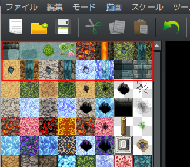

次の画面の水地形は A1 オートタイルで、すべてホールタイルとなります。

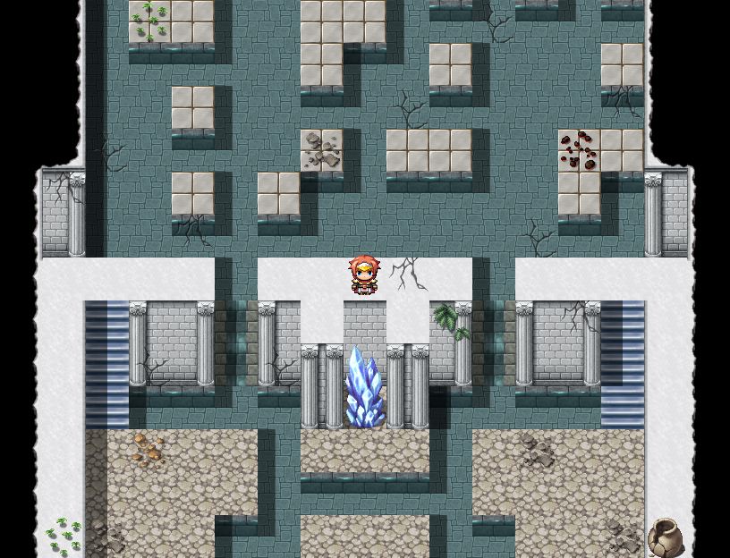


### エッジタイル

タイルセットの「通行（4方向）」により個別の通行可能方向が設定されたタイルを、エッジタイルと呼びます。

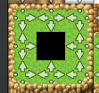

崖などを表現するためのオートタイルは自動的に通行可能方向が設定されることがありますので注意してください。


### マップオブジェクト

本プラグインによって様々な効果を与えられるイベントを、マップオブジェクトと呼びます。

キャラクターが上に乗ることができるイベントは代表的なマップオブジェクトです。

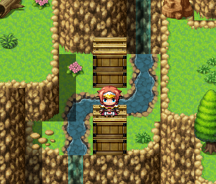


### ガイドライン

箱オブジェクトの移動可能範囲を示すタイルです。

`地形タグ 7` のタイルはガイドラインとなります。（プラグインのパラメータの GuideLineTerrainTag で変更できます）

ガイドラインとして地形タグが設定されたタイルは、下層タイルの通行可否などの設定を上書きしません。
次の画面の例では、小石で囲まれたタイルがガイドラインです。通常は崖から右へ移動できてしまいますが、この性質により移動できなくなります。

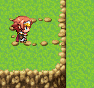


### マップスキル

マップオブジェクトに対して移動やイベント起動などの効果を与えるスキルを、マップスキルと呼びます。


## キャラクター移動の拡張

このセクションの機能は、本プラグインを有効にするだけですべてのキャラクター（プレイヤーとイベント）に対して有効になります。

### 1マス分のホールタイルのジャンプ

ホールタイルへ向かって移動したときに1マス先に移動可能タイルがある場合、ホールタイルをジャンプで飛び越えます。

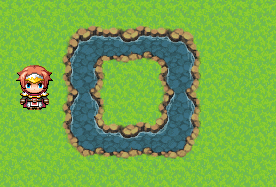

移動先にすり抜けできないイベントがある場合はジャンプできません。


### 1マス分のエッジタイル間のジャンプ

エッジタイルの通行不可方向が1マス分開けて向かい合っている場合、ジャンプで飛び越えます。

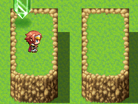

間のタイルの通行可否は関係ありません。

:warning: なお、単純に向かい合っているかどうかで判断するため、見かけ上の位置や高さが違う場所へジャンプできてしまう点に注意してください。

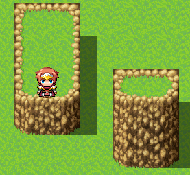


## マップオブジェクト

### マップオブジェクトの作り方

イベントの [実行内容] に、注釈として `@MapObject` を含めると、そのイベントはマップオブジェクトとなります。
さらに `@MapObject` に続く `{ }` の中にマップオブジェクトの詳細設定を記述します。


## マップオブジェクト - 箱


### パラメータ

| 名前 | 値 | デフォルト |説明 |
|------|------|------|------|
| box | - | - | - |
| height | 整数値 | 1 | オブジェクトの高さをタイル単位で指定します。1以上にしてください。 |
| fallable | bool 値 | false | true を指定すると、崖際などから落下できるようになります。 |


注釈の例：

```
@MapObject {
  box,
  height:1,
}
```


### 箱オブジェクトに歩行で乗る

エッジタイルの通行不可能方向に隣接している箱オブジェクトへ歩行移動で乗ることができます。

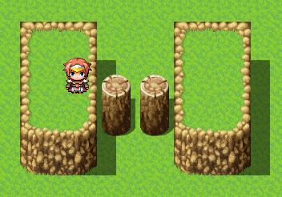

:warning: 何かが乗っている箱オブジェクトのイベントページが切り替わった場合、乗っているキャラクターは箱オブジェクトの位置へ落下します。


### 箱オブジェクトにジャンプで乗る

エッジタイルの通行不可能方向に1マス離れている箱オブジェクトへジャンプ移動で乗ることができます。

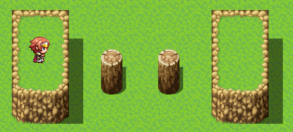

### 特定のイベント実行による箱オブジェクトからの降下


キャラクターは箱オブジェクトに乗っている場合、移動操作に制限を受ける状態となります。
（例えば、斜め移動はできません）

イベントの場所移動コマンドや移動ルートのジャンプコマンドなど、上下左右の移動以外でキャラクターの位置が変更される場合、キャラクターは箱オブジェクトから降り、通常の移動ができるようになります。

次の例は、移動ルートのジャンプコマンドによって箱オブジェクトから降ります。

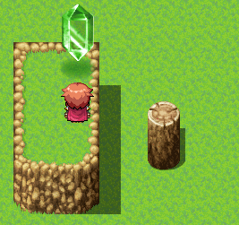

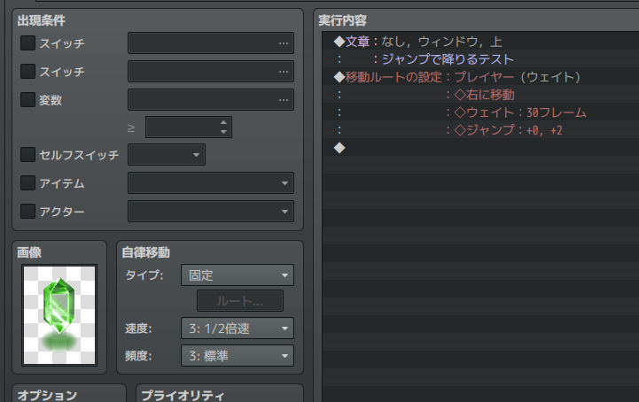


### 箱オブジェクトを押して移動する

箱オブジェクトはキャラクターが接触すると、キャラクターの向きの方向へ移動します。

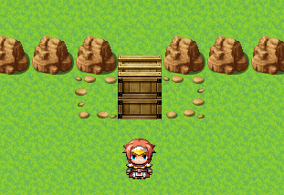

この移動は `ガイドライン (地形タグ 7 のタイル)` 上に限られます。

基本としてオートタイルに地形タグを割り当て、地形を装飾しつつ移動可能な範囲を示す使い方を想定しています。

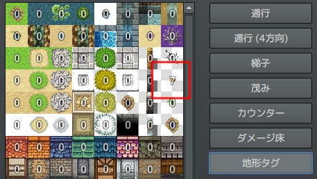


### 箱オブジェクトの落下

エッジタイルの通行禁止方向に押して移動させたとき、落下することができます。

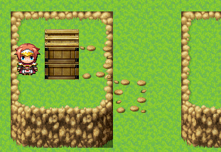

デフォルトでは落下しません。パラメータとして `fallable:true` を指定することで落下できるようになります。

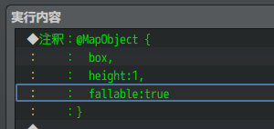

処理としては、 `地形タグ 7` のタイルが見つかるまで下方向へのすり抜け移動を行います。

そのため **必ず落下可能な場所の下方向に 地形タグ 7 のタイルを配置してください。**


### 箱オブジェクトの積み重ね

落下中の箱オブジェクトは、下方向に別の箱オブジェクトがある場合、その上に乗ります。

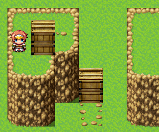

箱オブジェクトが積み重なっている場合、下の箱オブジェクトは押して移動することができなくなります。


### 箱オブジェクト落下時のイベント起動


パラメータとして `trigger:onStartedFalling,` を指定すると、落下開始時にイベントを起動します。


### キャラクターの乗降によるイベントの起動

パラメータとして `trigger:onRideOnEvent` を指定すると、キャラクターが上に乗った時にイベントを起動します。

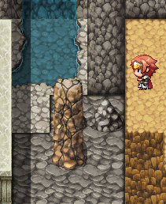

なお、`trigger` が指定されている場合、通常の "トリガー" によるイベント実行は行われません。


### マップオブジェクトの位置の永続化

パラメータとして `positional` を指定すると、マップを移動しても位置を記憶するようになります。

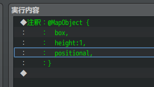


## マップオブジェクト - Plate (感圧板)

- Plate は常に "すり抜け" がON です。
- Plate の見た目上のプライオリティは常に "通常キャラの下" になります。

### パラメータ


### キャラクターの乗降によるイベントの起動


## マップオブジェクト - 丸太


### パラメータ


### 丸太タイプマップオブジェクトの移動


### 溝への落下


### 上に乗れる丸太


## マップオブジェクト - 滑り台


### パラメータ


## マップオブジェクト - ホール

ホールタイルと同様、1マスまでならジャンプで飛び越えられるオブジェクトです。


## マップスキル


### 対応するイベントを起動するスキル


### 箱タイプのマップオブジェクトを移動させるスキル


### 見えないイベントを可視化するスキル


## タッチ操作による自動移動について


## 他プラグインとの競合情報
- triacontane 様の HalfMove.js と併用する場合は、本プラグインをリストの下に追加してください。
- サンシロ 様の SAN_AnalogMove.js と併用する場合は、本プラグインをリストの下に追加してください。

## ライセンス情報

本プラグインはMITライセンスのもとで公開しています。

[The MIT License (MIT)](https://opensource.org/licenses/mit-license.php)

また、テストプロジェクトには動作確認のため以下のプラグインが含まれています。
- [HalfMove.js](https://github.com/triacontane/RPGMakerMV/blob/master/HalfMove.js) が含まれています。
- [SAN_AnalogMove.js](https://github.com/rev2nym/SAN_AnalogMove)
